# HFT MATLAB FPGA Prototype

This project is a low-cost FPGA-assisted high-frequency trading research prototype built around MATLAB, VHDL, C++, and the Intel/Terasic DE10-Nano.

The goal is to demonstrate an end-to-end market-data pipeline where ARM Linux receives a feed, the FPGA maintains simplified market state, and a MATLAB HDL Coder strategy decides whether to `BUY`, `SELL`, or do `NOOP`.

It is not a real trading system and it does not send exchange orders. It is a TCC/research platform for studying:

- ARM-to-FPGA communication through the HPS lightweight bridge
- FPGA-side order book/state processing
- MATLAB-to-VHDL strategy generation
- DE10-Nano deployment with Quartus Prime Lite

At a high level, the prototype does this:

1. Generate a synthetic FAST-style market-data feed.
2. Decode it on the ARM/HPS side.
3. Pack each market-data update into a fixed 8-word FPGA frame.
4. Send that frame through the HPS lightweight bridge into FPGA logic.
5. Maintain a small FPGA order book.
6. Run a MATLAB HDL Coder strategy block in the FPGA.
7. Return `NOOP`, `BUY`, or `SELL` plus top-of-book data to Linux.

## The Normal Workflow

Do this when setting up a fresh machine or after changing the board image:

```bash
make de10-sysroot
make matlab-login
```

Then the normal build/deploy flow is:

```bash
make build
```

After `make build`, program the FPGA manually with Quartus Programmer:

```text
quartus/de10_nano_hft/output_files/de10_nano_hft.sof
```

Then copy the ARM binaries to the DE10-Nano:

```bash
make deploy
```

Finally run the feed and receiver on the board:

```bash
ssh root@192.168.7.1 'cd /home/root && ./fast_data_feed'
```

In another terminal:

```bash
ssh root@192.168.7.1 'cd /home/root && HFT_FPGA_MMIO_BASE=0xFF200000 ./fast_receiver'
```

Stop both programs with:

```bash
make de10-stop
```

## Important Manual Step

`make build` creates the FPGA bitstream, but it does not automatically program the board unless you explicitly use JTAG automation.

The generated bitstream is:

```text
quartus/de10_nano_hft/output_files/de10_nano_hft.sof
```

Program that `.sof` in Quartus Programmer before running `fast_receiver` with `HFT_FPGA_MMIO_BASE=0xFF200000`.

If USB-Blaster/JTAG works from your shell, this command can program it:

```bash
make quartus-program
```

Otherwise, open Quartus Programmer and program the `.sof` manually.

## One-Time Setup Details

### Board Sysroot

`make build` cross-compiles ARM binaries for the DE10-Nano. To do that without SSH during every build, it needs a local copy of the board libraries and headers:

```text
/tmp/de10nano-sysroot
```

Create or refresh it with:

```bash
make de10-sysroot
```

This command does use SSH once. It copies `/lib`, `/usr/lib`, and `/usr/include` from:

```text
root@192.168.7.1
```

It also adds Boost headers into the sysroot for the cross-build.

If you see this error:

```text
Incomplete /tmp/de10nano-sysroot: missing usr/include/boost/version.hpp.
Run 'make de10-sysroot' once while the board is reachable.
```

the fix is exactly:

```bash
make de10-sysroot
```

After that, rerun:

```bash
make build
```

`make build` now checks this at the start so it fails fast instead of waiting until the end.

### MATLAB Docker Login

The MATLAB strategy is generated with HDL Coder through Docker.

Build/login once:

```bash
make matlab-login
```

This uses:

```text
hft-matlab-hdl:r2025b
```

and stores the MathWorks login in this Docker volume:

```text
hft-matlab-home-r2025b
```

If MATLAB cannot read your terminal, force Docker TTY mode:

```bash
make matlab-login MATLAB_DOCKER_FLAGS="-it"
```

To rebuild the MATLAB Docker image:

```bash
make matlab-docker-image MATLAB_DOCKER_REBUILD=1
```

## What `make build` Does

`make build` is intended to be the one local build command.

It does:

- check the local DE10-Nano sysroot
- regenerate `strategy.vhd` from `matlab/strategy.m`
- run host C++ tests
- run the feed/receiver smoke test
- run VHDL simulations
- cross-build `fast_receiver` and `fast_data_feed` for the DE10-Nano ARM Linux image
- regenerate Platform Designer HDL
- compile the Quartus `.sof`

It does not:

- SSH into the board
- copy files to the board
- program the FPGA automatically
- silently reuse an old `strategy.vhd` if MATLAB fails

## What `make deploy` Does

`make deploy` only copies the already-built ARM binaries to:

```text
root@192.168.7.1:/home/root
```

It copies:

```text
cpp/build-cross-de10/fast_receiver
cpp/build-cross-de10/fast_data_feed
```

Use `make build` first, then program the `.sof`, then use `make deploy`.

## Architecture

```mermaid
flowchart LR
    Feed["fast_data_feed<br/>synthetic FAST feed"]
    Receiver["fast_receiver<br/>decode + pack event"]
    MMIO["FpgaSharedStream<br/>/dev/mem MMIO"]
    Bridge["HPS lightweight bridge<br/>0xFF200000"]
    Avalon["hft_trade_engine_avalon_mm<br/>Avalon-MM slave"]
    Rings["arm_fpga_shared_stream_bridge<br/>TX/RX rings"]
    Book["order_book_core<br/>FPGA order book"]
    Wrapper["generated_strategy_core<br/>strategy wrapper"]
    Strategy["strategy.vhd<br/>MATLAB HDL Coder"]
    Output["fast_receiver output<br/>action + book snapshot"]

    Feed -- "TCP FAST-like messages" --> Receiver
    Receiver -- "8-word book event" --> MMIO
    MMIO -- "writes TX ring" --> Bridge
    Bridge -- "Avalon-MM transaction" --> Avalon
    Avalon -- "register access" --> Rings
    Rings -- "event stream" --> Book
    Book -- "best bid/ask + spread + imbalance" --> Wrapper
    Wrapper -- "strategy inputs" --> Strategy
    Strategy -- "NOOP / BUY / SELL" --> Wrapper
    Wrapper -- "8-word response" --> Rings
    Rings -- "RX ring response" --> Avalon
    Avalon -- "read response" --> Bridge
    Bridge -- "MMIO read" --> MMIO
    MMIO -- "decoded response" --> Output
```



The key idea:

- ARM/HPS software parses FAST and talks to FPGA registers.
- FPGA logic does the book update and strategy decision.
- The bridge between them is an 8-word shared-memory frame over MMIO.

## Frame Contract

ARM to FPGA event:

| Word | Meaning |
|---|---|
| `word0` | sequence number |
| `word1` | `symbol_id` |
| `word2` | price scaled by `1e4` |
| `word3` | quantity |
| `word4` | event type: `1=UPSERT_LEVEL`, `2=DELETE_LEVEL`, `3=RESET_BOOK` |
| `word5` | side: `1=BUY`, `2=SELL` |
| `word6` | level hint / future order-id placeholder |
| `word7` | reserved |

FPGA to ARM response:

| Word | Meaning |
|---|---|
| `word0` | echoed sequence number |
| `word1` | action: `0=NOOP`, `1=BUY`, `2=SELL` |
| `word2` | best bid price scaled by `1e4` |
| `word3` | best bid quantity |
| `word4` | best ask price scaled by `1e4` |
| `word5` | best ask quantity |
| `word6` | spread scaled by `1e4` |
| `word7` | signed imbalance, `best_bid_qty - best_ask_qty` |

The full bridge/register documentation is in:

```text
docs/arm-fpga-shared-memory-stream.md
```

## MATLAB Strategy

The strategy source is:

```text
matlab/strategy.m
```

The HDL generation script is:

```text
matlab/hdl_generator.m
```

Generate VHDL with:

```bash
make matlab-hdl-generate
```

Generated VHDL lands at:

```text
matlab/generated_hdl/codegen/strategy/hdlsrc/strategy.vhd
```

Quartus includes that generated file through:

```text
quartus/hft_trade_engine_avalon_mm_hw.tcl
```

The current strategy is intentionally simple:

- update bid/ask levels inside FPGA logic
- compute best bid, best ask, spread, and imbalance
- `BUY` when imbalance is at least `500` and spread is at most `2.5000`
- `SELL` when imbalance is at most `-500` and spread is at most `2.5000`
- otherwise `NOOP`

## Quartus Project

Open this project in Quartus Prime Lite:

```text
quartus/de10_nano_hft/de10_nano_hft.qpf
```

The main Platform Designer system is:

```text
quartus/de10_nano_hft/hft.qsys
```

The generated FPGA bitstream is:

```text
quartus/de10_nano_hft/output_files/de10_nano_hft.sof
```

## Useful Commands

```bash
make help
make build
make deploy
make de10-sysroot
make matlab-login
make matlab-hdl-generate
make check
make vhdl-test-engine
make vhdl-test-avalon
make quartus-program
make de10-stop
```

## Notes

- The stock Ubuntu ARM cross-compiler is too new for the DE10-Nano Angstrom image.
- The Makefile uses an older Bootlin ARM toolchain for the DE10-Nano build.
- `patches/mfast-armv7-boost-hash.patch` is required for 32-bit ARM `mFAST` builds.
